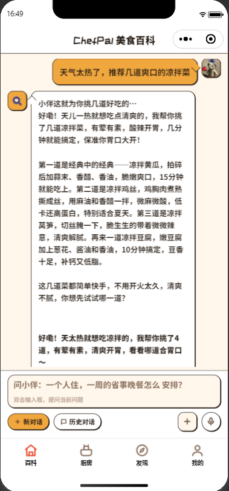
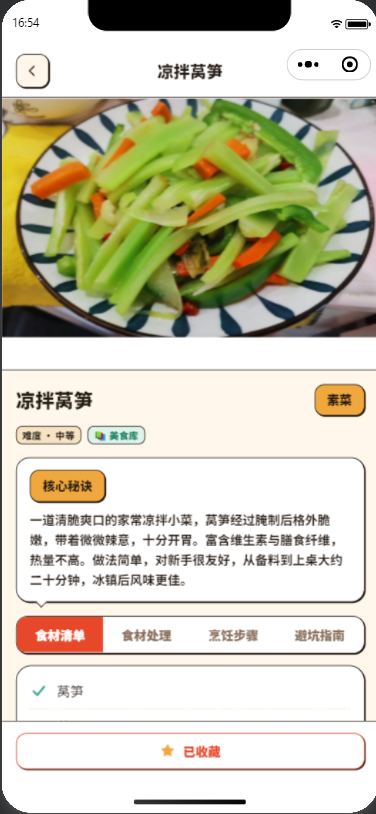
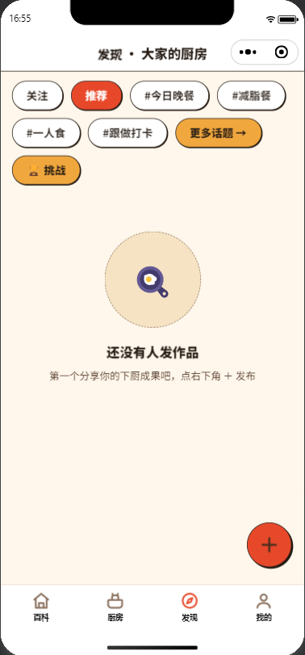
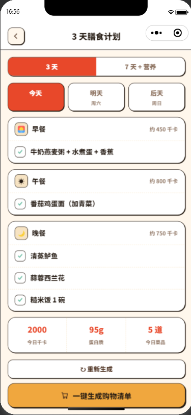
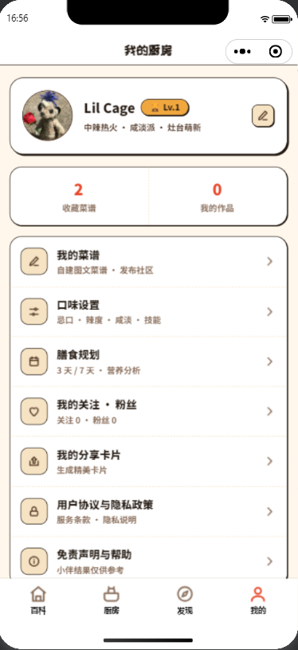

# 🍳 ChefPal · 口袋 AI 厨师

一个微信小程序：告诉它你手头有什么食材、想吃什么，它当场给你生成菜谱。不用翻菜谱库，也不用刷社区帖。

## 功能

| 模块 | 说明 |
|------|------|
| 对话式首页 | 多轮问答，AI 联网搜索 + 结构化回答，SSE 流式打字机，问答历史/收藏，菜名直达知识库详情 |
| 菜谱知识库（RAG） | HowToCook 386 条种子 + AI 沉淀，pgvector 向量检索，命中免 AI 秒回；未收录菜名 AI 现生成并入库 |
| 食材魔方 | 输食材（文字/拍照/语音）→ AI 生成 TOP3 菜谱，标注匹配度 / 时间 / 难度 / 缺什么调料 |
| 发现 · 社区广场 | 作品发布、瀑布流、点赞/评论、话题、关注、带小程序码分享卡片 |
| 我的厨房 | 微信一键登录、口味记忆（忌口/辣度/咸淡/技能）、菜谱/知识库收藏、我的作品、引导 |
| 膳食规划 | 3 天 / 7 天膳食规划 + 营养分析、购物清单一键生成 |
| 时令食材日历 | 当月应季食材与推荐做法 |
| 黑暗料理拯救 | 拯救失败食材/黑暗料理的 AI 方案 |
| 家庭投票 | 一家口味投票 + AI 结合投票结果推荐菜 |
| 烹饪挑战 | 每日挑战任务与打卡 |
| 菜谱进化树 | 同一道菜的多种做法演化关系 |
| 多智能体协作 | 营养师 + 大厨 + 采购多角色协作出方案 |
| 语音助手 | 语音输入（ASR）+ 语音烹饪助手 |
| 冰箱管家 | 食材过期预警与处置建议 |
| 链接/文档解析 | 网页 / B 站视频 / PDF 文档 → 提取菜谱结构化入库 |

## 功能展示

| **首页 · 对话式问答**<br>多轮会话，AI 联网搜索 + 结构化回答（核心秘诀 / 食材 / 步骤 / 避坑），SSE 流式打字机逐字展示，可收藏、可恢复历史对话<br> | **厨房 · 食材魔方**<br>输食材（文字 / 拍照 / 语音）→ AI 生成 TOP3 菜谱，标注匹配度 / 时间 / 难度 / 缺什么调料<br> |
|:---:|:---:|
| **菜谱知识库详情**<br>RAG 向量检索，HowToCook 386 条种子 + AI 沉淀；分段展示食材清单 / 烹饪步骤 / 避坑指南，未收录菜名可现生成<br> | **发现 · 社区广场**<br>作品发布、瀑布流浏览、点赞 / 评论、话题标签、关注、带小程序码分享卡片<br> |
| **3/7 天膳食规划**<br>按口味记忆生成 3 / 7 天膳食计划 + 营养分析，购物清单一键生成<br> | **我的 · 收藏 / 作品**<br>微信一键登录、口味记忆注入、菜谱 / 知识库收藏、我的作品，漫画插画风 UI<br> |

## 技术栈

| 层 | 选型 |
|----|------|
| 小程序前端 | **Taro 4 + React 18 + TypeScript + NutUI-React** |
| 后端 | **FastAPI + SQLAlchemy(async/asyncpg) + Alembic** |
| 数据库 | **PostgreSQL 16 + pgvector**（JSONB 结构化数据 + 向量检索） |
| 大模型 | **阿里云百炼 DeepSeek** |
| 向量/语音 | **百炼 text-embedding-v3**（RAG）、**qwen3-asr-flash**（语音识别） |
| 视觉 | **智谱 GLM-4V**（拍照识食材，可选） |
| 认证 | 微信 code2Session + JWT |
| 存储 | 腾讯云 COS（社区作品图片，未配置自动回落本地磁盘） |
| 部署 | Docker+微信云托管 |
| AI 编程工具 | GitHub Copilot · Claude Code · OpenSpec · MCP · Agent Skills |
| AI 编程方法 | Harness Engineering · 规范驱动开发（SDD）· 原型赛马 · 上下文管理 |

## 目录结构

```
ChefPal/
├── apps/
│   ├── miniapp/            # 微信小程序前端（Taro 4）
│   │   └── src/pages/      # 37 个页面：首页问答/厨房/发现/我的/知识库详情…
│   └── server/             # FastAPI 后端
│       ├── app/            # 路由 / 服务 / 模型 / LLM 客户端
│       ├── alembic/        # 数据库迁移
│       ├── scripts/        # HowToCook 导入、数据回填、冒烟脚本
│       └── tests/          # 368 个 pytest 用例
├── docs/                   # 需求分析 + 方案设计文档
├── prototypes/             # HTML 高保真原型（漫画插画风，5+2 组 30+ 屏）
└── docker-compose.yml      # 本地 PostgreSQL（含 pgvector）
```

## 快速开始

### 环境要求

- **后端**：Python 3.11+、Docker（跑本地 PostgreSQL）
- **小程序**：Node 18+、pnpm/npm、[微信开发者工具](https://developers.weixin.qq.com/miniprogram/dev/devtools/download.html)

### 启动后端

```bash
# ① 启动 PostgreSQL（pgvector 镜像，自动建主库 + 测试库）
docker compose up -d postgres

# ② 安装依赖 + 配置环境变量
cd apps/server
python -m venv .venv && source .venv/bin/activate   # Windows: .venv\Scripts\activate
pip install -e .
cp .env.example .env                                # 填入下方必填项

# ③ 建表 + 导入知识库种子（HowToCook，需联网拉取）
alembic upgrade head
python scripts/fetch_howtocook.py && python scripts/import_howtocook.py

# ④ 启动服务（端口 8001）
uvicorn app.main:app --host 0.0.0.0 --port 8001
```

**必填环境变量**（`apps/server/.env`）：

| 变量 | 说明 |
|------|------|
| `WECHAT_APPID` / `WECHAT_SECRET` | 微信小程序密钥（登录） |
| `DASHSCOPE_API_KEY` | 阿里云百炼 API Key（问答/菜谱/语音等全部 AI 能力） |

**选填**：`ZHIPU_API_KEY`（拍照识食材）、`COS_SECRET_ID/KEY/REGION/BUCKET`（社区图片上 COS，默认回落本地 `uploads/`）。

> 未配置微信/百炼时，后端仍可启动，但登录与 AI 功能会返回明确错误——不影响本地开发测试。

### 启动小程序

```bash
cd apps/miniapp
npm install
cp .env.example .env        # 默认 API 指向 http://127.0.0.1:8000，如后端在 8001 需同步修改
npm run dev:weapp           # 用微信开发者工具打开 apps/miniapp/dist
```

> 开发者工具需勾选「不校验合法域名」以访问本地后端。

## 测试

```bash
cd apps/server
pytest -q          # 368 个用例，覆盖认证/问答/知识库/社区/规划/购物/挑战等全部模块
```

> 测试需要本地 PostgreSQL（`docker compose up -d postgres` 即可）。用例通过 mock 隔离大模型调用，无需真实 API Key。

## 文档与原型

- [需求分析文档](docs/需求分析文档.md) —— 产品定位、用户画像、功能点、扩展路线
- [方案设计文档](docs/方案设计文档.md) —— 技术选型、系统架构、数据库、Prompt 工程

## 说明

- AI 生成的菜谱与回答为通用烹饪建议，**仅供参考，不构成医疗 / 营养处方**。
- 本项目为个人学习 / 演示项目，代码按 [MIT](LICENSE) 协议开源。
