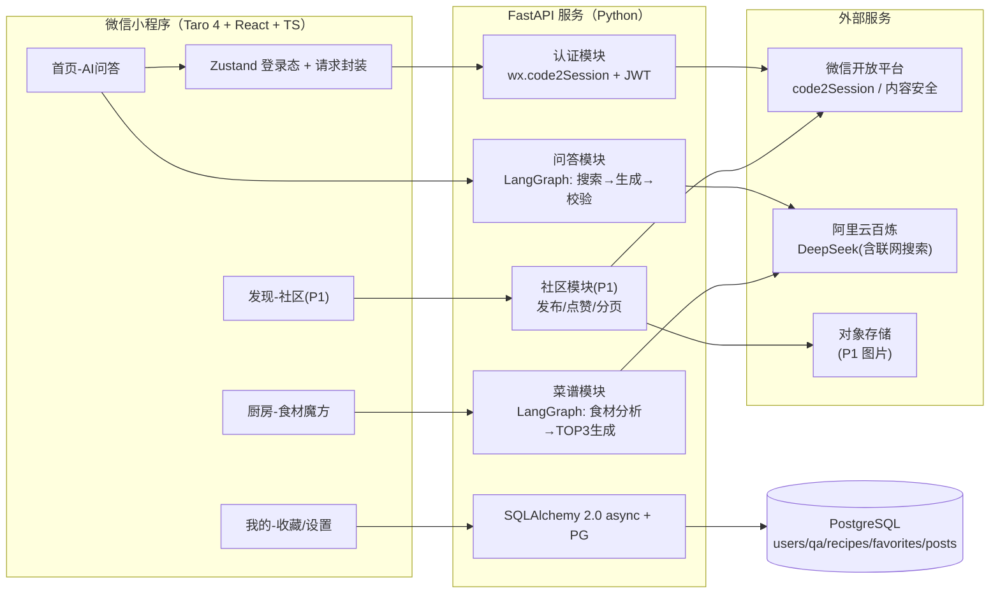
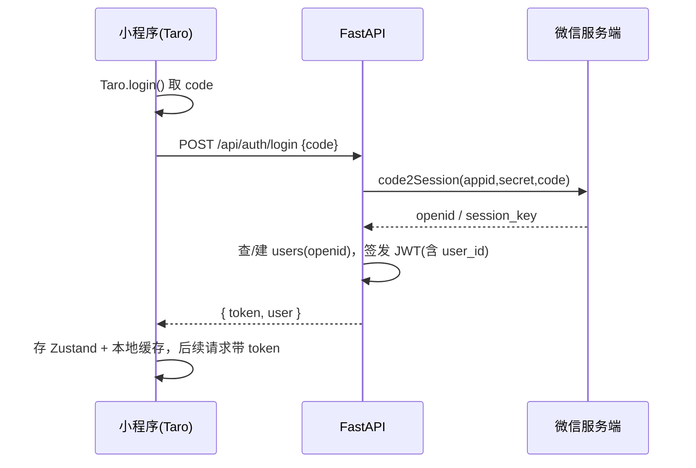
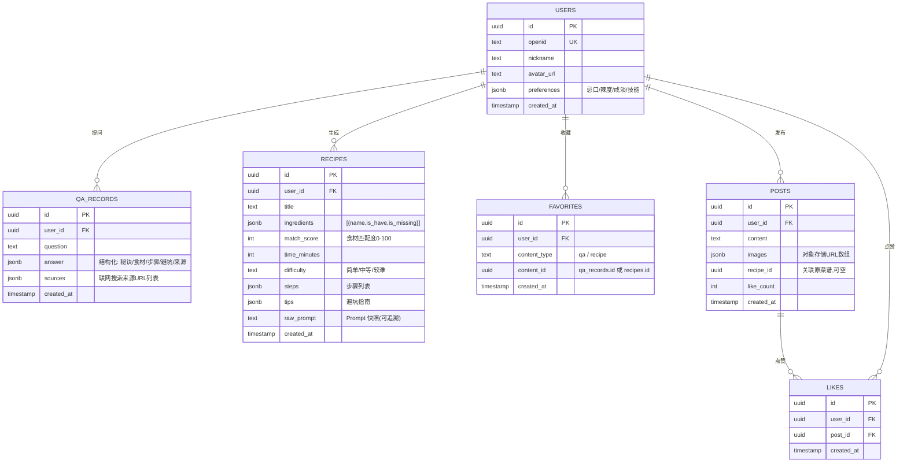
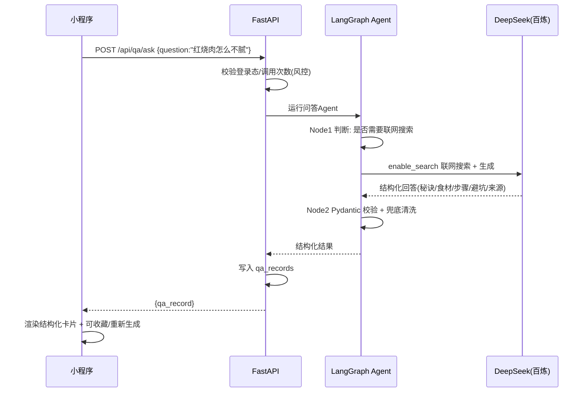
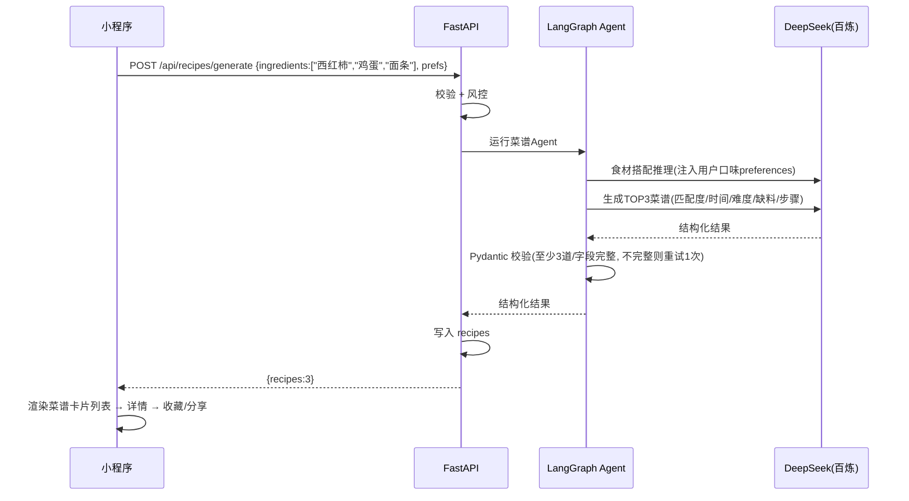

# 《ChefPal》方案设计文档

> **版本：** v1.0（2026-08-07）
> **文档定位：** 基于《需求分析文档》的技术落地设计，含技术选型、系统架构、数据库、核心流程、AI/Prompt 工程、分步实施计划、部署与风控。
> **核心原则：** 分步骤实现，先跑通核心业务闭环，再横向扩展功能；技术选型基于 2026 年 8 月最新生态实况。

---

## 一、需求理解与核心闭环定义

### 1.1 一句话理解

> ChefPal = **动态生成式 AI 烹饪伴侣**（微信小程序）。不做"菜谱库检索"，做"基于你的食材 + 你的目标实时生成方案"。差异化在于 **生成式**（区别于下厨房/豆果的检索式）。

### 1.2 与需求文档的关系

| 需求文档章节 | 本方案对应 |
|--------------|-----------|
| 二、MVP 功能点 | 六、核心业务流程 / 九、分步实施计划 |
| 二.2 MVP 技术栈（"云开发或 Next.js+Supabase"） | **三、技术选型 → 已按你的决策改为 FastAPI+LangChain** |
| 四、用户操作流程图 | 六、核心业务流程（补充时序与数据流） |
| 五、需求功能核对清单 | 九、分步实施计划（映射到各阶段任务） |
| 六、验证指标 | 九、里程碑验收标准 |

### 1.3 MVP 最小可跑通闭环（本项目第一目标）

```
用户微信登录 → 输入食材（厨房Tab）→ AI生成TOP3菜谱 → 查看详情/收藏
             → 提问厨艺问题（首页Tab）→ AI联网搜索+结构化回答 → 历史记录/收藏
```

**"厨房：食材→菜谱"是产品最核心的差异化功能，优先于社区（P1）。** 先打通这条主线，再扩展问答、收藏、社区。

---

## 二、关键决策一览

已与你人工确认，冻结如下：

| # | 决策项 | 结论 | 一句话理由 |
|---|--------|------|-----------|
| 1 | 小程序前端框架 | **Taro 4 + React + TypeScript** | 跨端复用潜力 + React 生态 + 2026 当前主版本 4.2.x |
| 2 | UI 组件库 | **NutUI-React**（备选 taroify） | 京东官方维护活跃、Taro 官方文档集成；taro-ui 已弃维护 |
| 3 | 后端架构 | **FastAPI + LangChain/LangGraph（Python）** | LLM 编排生态最成熟、结构化输出/Agent 原生支持 |
| 4 | AI 大模型 | **阿里云百炼 DeepSeek（v4-flash 为主 / v4-pro 兜底）** | 中文强、便宜、**原生支持联网搜索**（首页 P0 必需） |
| 5 | 数据库 | **PostgreSQL** | 与 Python/LLM 生态契合、JSONB 存结构化菜谱、pgvector 预留 RAG |
| 6 | 部署 | **先本地开发，上线后置** | 见 十、部署方案（需域名备案 + HTTPS） |
| 7 | 认证 | 微信 code2Session + JWT | 后端自建，不走云开发 |
| 8 | 现状 | 已有 AppID / AI API Key / 微信开发者工具 | 准备阶段无需再申请账号 |

---

## 三、技术选型（重点：小程序前端框架横向对比）

> 需求文档明确"由于小程序开发更新迭代非常快，重点对比小程序的技术选型"。本节为全文档核心。

### 3.1 小程序前端框架选型对比（2026-08 实况）

**候选集：** 原生微信小程序 / **Taro 4.x** / uni-app / uni-app x / 其他（wepy、mpvue、Remax、mPaaS、Kuikly）

| 维度 | 原生微信小程序 | **Taro 4.x（选定）** | uni-app | uni-app x |
|------|----------------|----------------------|---------|-----------|
| 语言框架 | WXML/WXSS/JS-TS | **React / Vue / Preact** | Vue3 | Vue3 + uts（编译原生） |
| 首屏渲染（参考数据） | ~320ms | ~450ms（多一层运行时） | ~380ms | ~近原生 |
| 包体积增量 | 基准 | +150~200KB | +80~120KB | 较小 |
| 跨端覆盖 | 仅微信 | **微信/支付宝/抖音/百度/京东/QQ/快手/飞书 + H5 + RN + 鸿蒙** | 微信/支付宝/抖音/H5/App | 微信/App（原生渲染） |
| 构建工具 | 微信开发者工具 | **Vite + SWC（@tarojs/binding）** | Vite / HBuilderX | HBuilderX |
| React 生态复用 | ❌ | ✅ 与 Web(Next/Remix) 共享 hooks | ❌（Vue） | ❌ |
| 状态管理 | 自定义 | Redux/Zustand/MobX 均可 | Pinia/Vuex | Pinia |
| 云开发集成 | ✅ 官方 | ⚠️ 需插件（本项目不用云开发） | ✅ | ✅ |
| 维护状态（2026） | 官方长期 | **主版本 4.2.1（2026-07-17），3.6 并行维护** | 活跃 | 活跃 |
| 学习成本 | 中（WXML 特殊语法） | 中（会 React 即上手） | 低 | 低 |
| 适用场景 | 只做微信、极致性能 | **有跨端/Web/App 规划、React 团队** | Vue 团队、要出 App | 要原生 App 性能 |

**逐项分析（选 Taro 4 的依据）：**

1. **跨端价值**：Taro 4 支持一套代码编译到微信小程序 + H5 + RN + 鸿蒙。ChefPal 未来的"Web 官网 / 分享落地页 / 多端"可直接复用业务逻辑与 hooks。这是原生方案给不了的。
2. **React 生态**：Taro 4 核心基于 React 运行时，可共享 Redux/Zustand、React Query、自定义 hooks；后续若做 H5 管理端或落地页，同一套人/react 心智可复用。
3. **版本健康度**：Taro 3 曾长期是主流，但 **2025-2026 已全面转向 4.x**（4.1.7 → 4.2.1 稳定迭代），采用 Vite + SWC 原生 binding，构建与编译速度明显优于 3.x。3.6 分支仍在并行修 bug，说明社区迁移平稳、不是"弃旧上新"的断裂式升级。
4. **性能补偿**：Taro 4 首屏比原生略慢（约 +130ms），但对 ChefPal 这类以"长文本/AI 生成结果展示"为主的内容型小程序，非强交互场景，感知差异可忽略。用 Taro 官方 `Taro.nextTick`、合理 setData 拆分即可。
5. **组件生态**：Taro 4 支持混用原生自定义组件（`PluginHelper` 等），需要时可直接嵌入微信原生能力（如 `wx.canvas` 画分享卡片、`wx.getUserProfile`）。

**为什么不选其他：**
- **原生**：无法跨端；若未来要做 H5 官网/分享落地页，等于重写一套。
- **uni-app**：Vue 系，与 React 选型不符；且你已明确要 Taro。
- **uni-app x**：偏 App 原生渲染，当前主战场是 App 端，小程序侧收益不大。
- **wepy/mpvue/Remax**：已停更/半停更。
- **mPaaS/Kuikly（腾讯新框架）**：mPaaS 商业化后社区停滞；Kuikly 2026 才开放 Web 支持，"一码五端"愿景好但新、坑多，不适合独立开发者 MVP。

**风险与缓解：** 跨端不是免费午餐——多一层抽象 = 一些微信原生特性需绕行（如 Skyline 渲染、部分原生组件）。缓解：项目内建 `platform/` 目录隔离平台差异，业务代码只调用封装层 API。

### 3.2 UI 组件库选型（Taro 4 + React）

需求文档 BASE-3 原计划"Vant Weapp"，但 Vant Weapp 是**原生小程序组件**，Taro 项目不适用，需换 Taro 系组件库：

| 组件库 | 技术栈 | 维护状态（2026） | 评价 |
|--------|--------|------------------|------|
| **taro-ui** | Taro+React | ❌ **已被官方弃维护**（GitHub issue 实锤） | 排除 |
| **NutUI-React** ✅ | Taro+React | ✅ 京东官方、活跃、Taro 文档有集成指南 | **选定** |
| **taroify** | Taro+React | ✅ 活跃（Vant 设计移植） | 备选，若更想要 Vant 视觉 |
| @antmjs/vantui | Taro+React | ⚠️ 社区维护 | 备选 |
| TDesign 小程序 | 原生 | ✅ 腾讯 | 原生不适用 |

**结论：NutUI-React**。理由：京东官方长期维护（与 Taro 同源京东系），组件 30+ 覆盖标签输入/瀑布流/分享/轻提示等 ChefPal 需要的场景，API 风格接近 Vant，上手成本低。**Phase 0 用 2 小时做一次组件冒烟**（如 Input 标签输入、Image 懒加载、瀑布流），若有个别组件不满足再换 taroify（两者成本接近）。

#### 3.2.1 顶部导航 UI 约束（重要，已与用户确认）

微信小程序自定义导航（`navigationStyle: custom`）时，**右上角悬浮微信「胶囊」按钮**（"···"与"○"）固定占位，与状态栏同高区域。因此：

- **顶部导航右上角禁止放置任何功能入口/操作按钮**（如"发布""相册""重新生成""清空""分享"等文本按钮或图标按钮），否则与胶囊按钮视觉冲突/互相遮挡。
- 顶部导航**只保留**：左返回键 + 居中标题。所有功能入口与操作按钮统一移到**页面底部操作栏（actbar）**或**页面内容区**（如输入区、卡片区）。
- 已按此约束优化全部 UI 原型（`prototypes/`）与小程序实现。

> 历史教训：曾尝试右上角"胶囊避让"方案（`getMenuButtonBoundingClientRect` 动态定位），最终弃用——右上角宁可留空，不做胶囊定位。

### 3.3 后端选型：FastAPI + LangChain/LangGraph

**决策**：FastAPI（Python）+ LangChain 1.x + LangGraph + SQLAlchemy 2.0（async）+ Alembic + PostgreSQL。

**为什么是 Python 后端（对比原需求文档两个候选）：**

| 维度 | **FastAPI+LangChain（选定）** | 微信云开发 CloudBase | Next.js + Supabase |
|------|------------------------------|---------------------|--------------------|
| LLM 编排能力 | ✅ **LangChain/LangGraph 原生**（Agent、结构化输出、工具调用） | ⚠️ 云函数 Node.js，LangChain-JS 能力弱 | ⚠️ 需自拼 OpenAI SDK |
| 联网搜索+结构化 | ✅ 百炼 DeepSeek + Pydantic Schema | ⚠️ 要自己接搜索/拼 Prompt | ⚠️ 同上 |
| 微信登录 | ⚠️ 需自接 code2Session | ✅ 零配置 | ⚠️ 自接 code2Session |
| 部署运维 | ⚠️ 需服务器+备案 | ✅ 免运维 | ⚠️ 需服务器+备案 |
| 数据可控/可移植 | ✅ 完全可控（PG 开源） | ⚠️ 绑定腾讯云 | ✅ |
| AI 原生 Agent 扩展（P3 多智能体） | ✅ LangGraph 原生支持多 Agent 编排 | ⚠️ 受限 | ⚠️ 受限 |

> **决策理由：** ChefPal 的本质是 **AI 编排密集型产品**（生成菜谱、联网搜索、多轮问答、P3 营养师+大厨+采购多 Agent），Python + LangChain/LangGraph 是这条赛道上生态最成熟、迭代最快的组合；结构化输出（Pydantic Schema）能直接保障"菜谱 JSON 落库"，这是 Node.js 侧没有的成熟度。代价是自担服务器与备案，已通过"部署后置"策略缓解。

**后端技术要点：**
- **FastAPI**：async 原生、Pydantic 校验、自动生成 OpenAPI 文档（前端可据此对齐接口）。
- **LangChain 1.x**：`ChatOpenAI(base_url=百炼compatible-mode)` 对接 DeepSeek；`create_agent()` + `response_format=Pydantic 模型` 实现**原生结构化输出**。
- **LangGraph**：`StateGraph` 编排"联网搜索→生成→校验"流水线，为 P3 多 Agent 预留。
- **SQLAlchemy 2.0 async + Alembic**：ORM 与迁移。
- **asyncpg**：PG 异步驱动。
- **依赖注入**：FastAPI Depends + 鉴权中间件。

### 3.4 AI 大模型选型：阿里云百炼 DeepSeek

**结论：`deepseek-v4-flash`（默认，快/便宜）+ `deepseek-v4-pro`（复杂问题兜底），经阿里云百炼 OpenAI 兼容接口接入。**

| 候选 | 中文能力 | 联网搜索（P0 必需） | 成本 | 接入复杂度 | 评价 |
|------|----------|--------------------|------|-----------|------|
| **DeepSeek 官方 API** | ✅ 强 | ❌ **API 不支持联网搜索**（仅官网网页端） | 低 | 低 | 单用不满足 P0 |
| **百炼 DeepSeek（选定）** | ✅ 强 | ✅ **`enable_search` / `web_search` 工具原生支持** | 低 | 低（OpenAI 兼容） | ✅ 一条 API 同时满足搜索+生成 |
| 微信 AI 成长计划·混元 | 中 | ✅ | **0（1 亿免费 token）** | 极低（3 行代码） | 可作 P2/P3 免费兜底，但非 DeepSeek |
| 豆包 / 通义千问 / Kimi | 中上 | 部分支持 | 中低 | 低 | 备选，切换成本低（都走 OpenAI 兼容） |

**接入要点：**
- base_url：`https://dashscope.aliyuncs.com/compatible-mode/v1`（或按百炼控制台给的 `{WorkspaceId}.cn-beijing.maas.aliyuncs.com/compatible-mode/v1`）。
- 联网搜索两种姿势：
  - **Chat Completions + `extra_body={"enable_search": True, "search_options": {...}}`**（本项目采用，控制力强：可强制搜索、设时效性、限来源站）。
  - Responses API + `tools=[{"type":"web_search"}]`（后续升级可选）。
- **成本锚点（以百炼控制台实时价为准）**：DeepSeek-v4-flash 输出价格极低（约 ¥0.1~0.5/M token 档）；联网搜索约 **$0.57 / 千次**（境内）；网页抓取当前免费。单人 MVP 月成本可控制在 **¥50 以内**（见 12.2）。
- **结构化输出**：DeepSeek-v4-flash/pro 在百炼均支持结构化输出，直接配合 Pydantic Schema。

### 3.5 数据库：PostgreSQL

- **JSONB** 字段存"菜谱结构化数据"（步骤/食材/配料）与"AI 回答结构化数据"，免去大量关联表。
- **pgvector** 预留：P2 引入 RAG（检索增强生成）时，可将菜谱/问答向量化做相似度召回，不必换库。
- 本地开发用 **Docker 起 PG**；上线可自建（同服务器）或托管（RDS/Neon/Supabase）。

### 3.6 其余选型汇总

| 项 | 选型 | 说明 |
|----|------|------|
| 前端语言 | TypeScript | Taro 4 官方推荐，类型安全 |
| 状态管理 | Zustand | 轻量，跨页共享登录态/用户信息 |
| 请求层 | Taro.request 封装 + 拦截器 | 统一加 JWT、错误码、loading |
| 图片上传 | 前端直传对象存储（OSS/七牛/COS） | P1 社区发布用；后端给上传凭证 |
| 内容安全 | 微信 `security.msgSecCheck` / `mediaCheckAsync` | 发布前检测文本与图片 |
| 埋点 | 自研轻量（云日志/自建表） | 页面访问、按钮点击 |
| 定时任务 | APScheduler / Celery（P2 再上） | MVP 无需 |

---

## 四、系统架构设计

### 4.1 整体架构图



### 4.2 前后端交互设计

- **API 风格**：REST，`/api/*` 前缀；FastAPI 自动出 OpenAPI 文档（`/docs`）。
- **鉴权**：请求头 `Authorization: Bearer <JWT>`。登录接口用 `code` 换 JWT（见 4.3）。
- **请求域名**（上线必配）：小程序后台 → 开发管理 → 服务器域名 → request 合法域名填入 `https://api.chefpal.com`（已备案）。**本地开发**在微信开发者工具勾选"不校验合法域名、web-view、TLS"即可访问 `http://127.0.0.1:8000`。
- **错误码约定**：统一 `{ code, message, data }` 结构；`401` 前端自动刷新登录态。

### 4.3 微信登录流程



> 昵称/头像：微信 2022 后 `wx.getUserProfile` 受限，建议用"头像昵称填写能力"（`button open-type="chooseAvatar"` + `input type="nickname"`），或 P1 再完善。MVP 阶段用户体系仅靠 openid + 匿名即可跑通闭环。

### 4.4 代码目录结构（Monorepo）

```
ChefPal/
├── docs/                       # 需求 + 本方案
├── apps/
│   ├── miniapp/                # Taro 4 + React 前端
│   │   ├── src/
│   │   │   ├── app.ts / app.config.ts
│   │   │   ├── pages/          # index(首页) kitchen(厨房) discover(发现) mine(我的)
│   │   │   ├── components/     # QACard / RecipeCard / IngredientInput ...
│   │   │   ├── platform/       # 平台差异封装（跨端预留）
│   │   │   ├── stores/         # Zustand
│   │   │   ├── services/       # API 调用
│   │   │   └── utils/request.ts
│   │   └── config/             # Taro 配置(env/appid)
│   └── server/                 # FastAPI 后端
│       ├── app/
│       │   ├── main.py         # FastAPI 入口
│       │   ├── core/           # config / security / deps
│       │   ├── routers/        # auth / qa / recipes / favorites / posts
│       │   ├── services/       # LLM / LangGraph agents / wechat
│       │   ├── models/         # SQLAlchemy 模型
│       │   ├── schemas/        # Pydantic(含 AI 输出 Schema)
│       │   └── db/             # session / alembic
│       ├── alembic/
│       ├── tests/
│       └── pyproject.toml
└── docker-compose.yml          # 本地 PG + 后端
```

---

## 五、数据库设计（MVP 核心表）



**关键设计说明：**
- `FAVORITES` 用 `content_type + content_id` 多态关联，统一管理"问答收藏 + 菜谱收藏"（对应需求文档"我的收藏"分类 Tab）。
- `QA_RECORDS.answer` 与 `RECIPES` 用 **JSONB** 存 AI 结构化输出，与 Pydantic Schema 一一对应，前端直接渲染。
- `RECIPES.raw_prompt` 存 Prompt 快照，便于排查"AI 生成不可靠"问题（需求文档风险一）。
- 索引：`users.openid`(unique)、`qa_records.user_id+created_at`、`favorites(user_id,content_type,content_id)`(unique)、`posts.created_at`。
- 可选 `ai_calls` 表记录每次调用 token/费用（用于成本风控，见 12.2）。

---

## 六、核心业务流程设计

### 6.1 流程一：AI 问答（首页，P0）



### 6.2 流程二：食材魔方 → AI 菜谱（厨房，P0·核心差异化）



### 6.3 流程三：收藏 / 我的（P0→P1）

- 收藏：`POST /api/favorites {content_type, content_id}` / 取消 `DELETE`；列表 `GET /api/favorites?type=qa|recipe`。
- 口味设置：`PUT /api/users/me/preferences`，存 JSONB；**注入菜谱 Agent 的 preferences**（P1 起生效）。

### 6.4 流程四：社区发布/点赞（P1，MVP 后）

- 发布：前端传图到对象存储 → `POST /api/posts`（后端调 `mediaCheckAsync` 安全校验）→ 写入 POSTS。
- 广场：`GET /api/posts?page=&size=` 分页（瀑布流）。
- 点赞：`POST /api/posts/:id/like` 幂等，`like_count` 冗余字段 + 每日 Redis/内存计数防刷。

---

## 七、API 接口清单（MVP）

| 方法 | 路径 | 说明 | 鉴权 | 阶段 |
|------|------|------|------|------|
| POST | /api/auth/login | `{code}` → `{token,user}` | 无 | 0 |
| POST | /api/qa/ask | `{question}` → 结构化回答 | ✅ | 1 |
| GET | /api/qa/history | 最近 20 条 | ✅ | 1 |
| DELETE | /api/qa/:id | 删单条历史 | ✅ | 1 |
| POST | /api/recipes/generate | `{ingredients,prefs?}` → 3 道菜 | ✅ | 2 |
| GET | /api/recipes/:id | 菜谱详情 | ✅ | 2 |
| POST | /api/favorites | `{content_type,content_id}` | ✅ | 2 |
| DELETE | /api/favorites | 取消收藏 | ✅ | 2 |
| GET | /api/favorites | `?type=` 列表 | ✅ | 2 |
| PUT | /api/users/me/preferences | 口味设置 | ✅ | 2 |
| POST | /api/posts | 发布作品 | ✅ | 3 |
| GET | /api/posts | 广场分页 | ✅ | 3 |
| POST | /api/posts/:id/like | 点赞 | ✅ | 3 |

> 统一响应 `{code:0, message:"ok", data:...}`；`code!=0` 前端按码提示。完整 OpenAPI 由 FastAPI 自动生成，前端以 `/docs` 为准对接。

---

## 八、AI / Prompt 工程与 LangGraph 编排

### 8.1 两个 Agent 的 LangGraph 设计

**问答 Agent（qa_agent）：**
```
StateGraph:
  路由节点: 判断是否需要联网搜索（厨艺问题默认开）
  生成节点: ChatDeepSeek + enable_search + 结构化输出(QASchema)
  校验节点: Pydantic 校验，失败则重试(≤1次)或降级返回纯文本
```

**菜谱 Agent（recipe_agent）：**
```
StateGraph:
  食材分析节点: 解析食材名/归类/可替代性
  偏好注入: 读取 users.preferences(忌口/辣度/技能) → 注入 system prompt
  生成节点: 输出 TOP3 菜谱(RecipeSetSchema)
  校验节点: 至少3道、字段完整；不满足则带修正指令重试1次
```

### 8.2 核心 Pydantic 输出 Schema（落库 & 前端渲染的依据）

```python
# schemas/ai.py
class QASchema(BaseModel):
    core_secret: str                 # 核心秘诀(一句话)
    ingredients: list[str]           # 食材清单
    steps: list[str]                 # 步骤(序号化)
    avoid_pitfalls: list[str]        # 避坑指南
    sources: list[str] | None        # 联网搜索来源URL

class RecipeStep(BaseModel):
    title: str
    detail: str

class GeneratedRecipe(BaseModel):
    name: str
    match_score: int = Field(ge=0, le=100)   # 食材匹配度
    time_minutes: int
    difficulty: str                          # 简单/中等/较难
    missing_seasonings: list[str]            # 缺什么调料(P1 展示)
    steps: list[RecipeStep]

class RecipeSetSchema(BaseModel):
    recipes: list[GeneratedRecipe]           # TOP3
```

### 8.3 Prompt 要点（对接需求文档"动态生成式"定位）

- **菜谱 Prompt 核心指令**："你是资深中餐厨师。基于用户现有食材 {ingredients} 与偏好 {prefs}，生成 3 道**可行性最高**的菜。每道标注匹配度(0-100)、预计时间、难度、缺少的调料与替代方案。步骤写给厨房小白看，明确每步时长与火候。遵守忌口 {allergies}。"
- **问答 Prompt**："用结构化方式回答用户厨艺问题，给出核心秘诀、食材、可执行步骤、常见翻车点。如无把握，用联网搜索补充事实。"
- **免责**：system 固定追加"输出为通用烹饪建议，不构成医疗/营养处方；对过敏原提示谨慎"。呼应需求文档审核风险。

### 8.4 成本与质量兜底

- 生成前：风控检查（单用户每日生成/提问次数上限）。
- 生成中：超时熔断（如 30s）、失败重试 1 次。
- 生成后：结构化校验失败 → 降级返回原样文本 + 前端友好提示。

---

## 九、分步实施计划（先跑通核心闭环）

> **开发思路（重点）：** ① 纵向切分，先打通"登录→食材→菜谱→收藏"完整竖切片，再横向扩功能；② 技术验证先行（Spike）——第 1 步先验证"百炼 DeepSeek + 联网搜索 + 结构化输出"能否跑通，这是最大技术风险；③ 前端可先用 mock 数据搭 UI，后端就绪后无缝切换真实 API；④ 以 FastAPI 自动生成的 OpenAPI 作为前后端契约。

### 里程碑总览

| 里程碑 | 周期 | 交付 | 验收标准 |
|--------|------|------|----------|
| **M0 环境与技术验证** | 2 天 | 本地环境 + Spike 脚本 | ✅ 百炼 DeepSeek 联网搜索+结构化输出跑通 |
| **M1 后端骨架 + 登录** | 3 天 | FastAPI + PG + code2Session/JWT | ✅ 微信登录拿到 token 并建用户 |
| **M2 核心闭环 A：问答** | 4 天 | 首页提问→联网→结构化→历史 | ✅ 任意厨艺问题得到结构化回答并入库 |
| **M3 核心闭环 B：食材→菜谱→收藏** | 5 天 | 厨房输入食材→TOP3→详情→收藏 | ✅ 核心差异化功能跑通（验收第一目标） |
| **M4 我的 + 收藏管理** | 3 天 | 登录态打通、收藏夹、口味设置 | ✅ 收藏可查可取消，口味注入生效 |
| **M5 社区（P1）** | 4 天 | 发布/广场/点赞/分享卡片 | ✅ 作品可发可赞，分享卡片可生成 |
| **M6 打磨与上线准备** | 3 天 | Prompt 调优/埋点/免责/审核 | ✅ 提审材料齐备，可提交审核 |
| **合计** | **~24 天** | 与需求文档估算一致（每天约 4 小时） | |

### M0～M3 详细任务（核心闭环优先）

**M0（2天）——环境与技术验证**
- [ ] 初始化 Monorepo：`apps/miniapp`（Taro 4 + React + TS）+ `apps/server`（FastAPI）
- [ ] 本地 Docker 起 PostgreSQL，SQLAlchemy + Alembic 骨架
- [ ] **Spike**：写 1 个 Python 脚本调百炼 DeepSeek（`enable_search=True`），验证"联网搜索 + 结构化 JSON 输出"，打印结果
- [ ] 百炼控制台开通 DeepSeek 模型，确认 base_url / API key / 限流
- [ ] Taro 4 项目跑起微信小程序，连微信开发者工具（勾选"不校验合法域名"）

**M1（3天）——后端骨架 + 登录**
- [ ] FastAPI 工程化（配置/.env/异常处理/日志/CORS）
- [ ] `users` 表 + `code2Session` → JWT 登录链路（4.3）
- [ ] 请求封装（Taro.request + token 注入 + 错误处理）与登录态 Zustand
- [ ] 全局 TabBar（首页/厨房/发现/我的）+ NutUI-React 引入冒烟

**M2（4天）——核心闭环 A：AI 问答（首页）**
- [ ] `qa_records` 表 + `qa_agent`（LangGraph 搜索→生成→校验）
- [ ] `POST /api/qa/ask`（含风控）+ `GET /api/qa/history`
- [ ] 首页 UI：输入框 + 结构化回答卡片（秘诀/食材/步骤/避坑）+ 历史列表
- [ ] 收藏问答 → `favorites` 表打通
- [ ] 验收：问"红烧肉怎么不腻"得到结构化回答，可收藏，历史可见

**M3（5天）——核心闭环 B：食材魔方（厨房·第一优先）**
- [ ] `recipes` 表 + `recipe_agent`（食材分析→偏好注入→TOP3→校验）
- [ ] `POST /api/recipes/generate` + `GET /api/recipes/:id`
- [ ] 厨房 UI：标签式食材输入（支持删除）+ 菜谱卡片（菜名/匹配度/时间/难度）+ 缺料提示
- [ ] 菜谱详情页 + 收藏按钮
- [ ] **验收（第一目标）**：输入"西红柿、鸡蛋、面条"→ 3 道菜 + 匹配度 + 步骤，可收藏，核心差异化闭环跑通

**M4～M6** 按里程碑表推进（我的/收藏管理/口味注入 → 社区 P1 → 打磨上线）。

### 与需求文档任务清单的映射

| 本方案阶段 | 对应需求文档任务 |
|-----------|-----------------|
| M0 | BASE-1/2/3/4（框架与准备，改为 Taro+NutUI 方案） |
| M1 | BASE-5/6/7 + UI-3.1/3.2 + API-3.1 + DATA-3.1 |
| M2 | UI-1.1~1.5 + API-1.1~1.4 + DATA-1.1/1.2 |
| M3 | UI-2.1~2.5 + API-2.1~2.3 + DATA-2.1/2.2 |
| M4 | UI-3.3/3.4 + API-3.2/3.3 + DATA-3.2 |
| M5 | 模块四（UI-4.x + API-4.x + DATA-4.x） |
| M6 | BASE-8 + 审核准备 |

---

## 十、部署方案（上线后置，预留）

### 10.1 本地开发环境（当前）

| 组件 | 方案 |
|------|------|
| 后端 | `uvicorn apps/server.app.main:app --reload`（默认 8000 端口） |
| 数据库 | `docker compose up postgres` |
| AI | 百炼 API key 配入 `.env` |
| 小程序 | 微信开发者工具打开 `apps/miniapp`，勾选"不校验合法域名"，请求 `http://127.0.0.1:8000` |

### 10.2 生产部署（上线前 1 周做）

1. **服务器**：腾讯云/阿里云轻量应用服务器（2C4G 即可，新用户约 ¥50~100/月）。
2. **域名 + 备案**：购买域名 → ICP 备案（工信部，周期约 7~20 天，**需提前启动**）。
3. **HTTPS**：域名解析到服务器，装 Nginx + Let's Encrypt 免费证书（或云厂商证书）。
4. **后端**：Docker 部署 FastAPI + PG（`docker-compose` 生产编排），Gunicorn+Uvicorn 多进程；对象存储挂 OSS/七牛。
5. **小程序配置**：后台 → request 合法域名 `https://api.chefpal.com`。
6. **安全**：`.env` 管理密钥、JWT 密钥、限流（RateLimit）、日志与异常上报（Sentry 可选）。

---

## 十一、安全与合规

| 项 | 措施 |
|----|------|
| 密钥 | appid/secret/API key 仅存后端 `.env`，不进前端包 |
| 登录态 | JWT 短期过期 + 静默刷新；openid 不暴露给前端 |
| 内容安全 | 发布文本走 `security.msgSecCheck`，图片走 `mediaCheckAsync`（P1） |
| 输入控制 | 问题/食材长度上限，防注入与超长 token |
| 成本风控 | 单用户每日 AI 调用上限；`ai_calls` 表记账；超出引导"明日再来" |
| 隐私合规 | 微信隐私保护指引声明（收集昵称/头像/作品图片）；用户可删除历史/收藏 |
| 免责声明 | AI 回答与菜谱统一标注"仅供参考，不构成医疗/营养建议"，规避审核风险 |

---

## 十二、成本估算

### 12.1 固定成本（MVP 期）

| 项 | 估算 |
|----|------|
| 服务器（上线后） | ¥50~100/月（轻量 2C4G） |
| 域名 + 证书 | ¥30~100/年 + 免费证书 |
| 对象存储（P1 后） | 免费额度够用，超出后 <¥10/月 |
| 数据库 | 自建（含在服务器内），或云托管 ~¥30/月 |

### 12.2 AI 调用成本（核心变量）

- 单次菜谱生成（含联网）约 0.5~1k 输出 token + 1 次搜索；单次问答类似。
- 按"每日 500 次 AI 调用"估算：DeepSeek-v4-flash 输出费 + 联网搜索（$0.57/千次）合计 **< ¥50/月**。
- **降本杠杆**：v4-flash 为主、v4-pro 仅复杂问题；P2 上下文缓存（百炼支持）减重复系统 prompt 成本。

---

## 十三、风险与应对

| 风险 | 等级 | 应对 |
|------|------|------|
| **AI 生成不可靠/翻车** | 高 | M0 Spike 先验证；Prompt 调优；结构化校验兜底；`raw_prompt` 快照可回溯；用户反馈入口 |
| **百炼 DeepSeek 联网搜索行为不符预期** | 高 | Spike 阶段专门验证；备选切官方 DeepSeek+博查/Serper（接口层做抽象） |
| **域名备案周期长** | 中 | 备案周期 7~20 天，**提前 1 个月启动**；开发期用"不校验域名"不受影响 |
| **成本超支** | 中 | 每日限额 + `ai_calls` 记账 + 全链路降本杠杆 |
| **小程序审核** | 中 | 免责声明、类目准确（生活服务-餐饮）、规避医疗绝对化用语 |
| **跨端抽象带来微信原生特性受限** | 低 | `platform/` 目录隔离；必要时 Taro 插件混用原生组件 |
| **Taro 4 生态依赖** | 低 | 锁定 4.2.x 版本；组件库 Phase 0 冒烟；3.6 分支可兜底回退 |

---

## 十四、后续扩展承接（对需求文档 P1~P3）

| 需求优先级 | 功能 | 本方案预留 |
|-----------|------|-----------|
| P1 | 拍照识食材 | 前端接图像 API；`ingredients` 已支持列表输入，识别结果直接注入 |
| P1 | 语音输入 | 微信 `RecorderManager` + 语音转文字，复用文本输入链路 |
| P1 | 3 天膳食规划 | LangGraph 新增 planner_agent；`users.preferences` 已就绪 |
| P2 | 7 天膳食规划 + 营养分析 | planner_agent 升级 + 营养 Schema |
| P2 | 购物清单 | 基于 `RecipeSetSchema` 聚合 |
| P2 | 链接/文档解析 | web_extractor（百炼免费）→ 结构化 → `qa_agent` 复用 |
| P3 | 多智能体协作 | **LangGraph 原生支持**（营养师+大厨+采购三 Agent） |
| P3 | RAG 检索增强 | pgvector + 向量化菜谱/问答库 |
| P3 | 分享卡片 | 前端 canvas 绘制 + 小程序码（`getUnlimited`） |

---

## 附录 A：环境准备清单（当前已就绪项打 ✓）

- [x] 微信小程序账号 / AppID（"生活服务-餐饮"类目）
- [x] 阿里云百炼 API Key（已开通 DeepSeek 模型）
- [x] 微信开发者工具
- [ ] Python 3.11+ 本地环境
- [ ] Node.js 18+ / pnpm
- [ ] Docker（本地 PG）
- [ ] Taro 4 CLI（`pnpm add -g @tarojs/cli`）

## 附录 B：文档变更记录

| 版本 | 日期 | 变更 |
|------|------|------|
| v1.0 | 2026-08-07 | 初稿：完成技术选型（Taro4+React / FastAPI+LangChain / 百炼DeepSeek / PG）、架构、数据库、核心闭环、分步计划 |
| v1.1 | 2026-08-10 | 新增 §3.2.1 顶部导航 UI 约束：右上角胶囊区禁止放功能入口，功能入口统一移底部操作栏/内容区；同步优化全部 UI 原型 |
