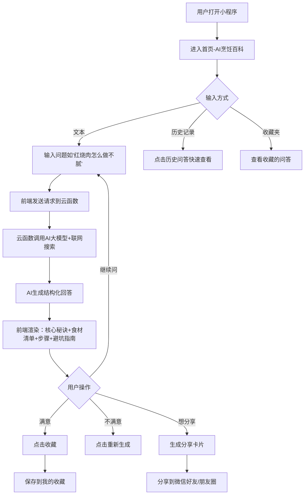
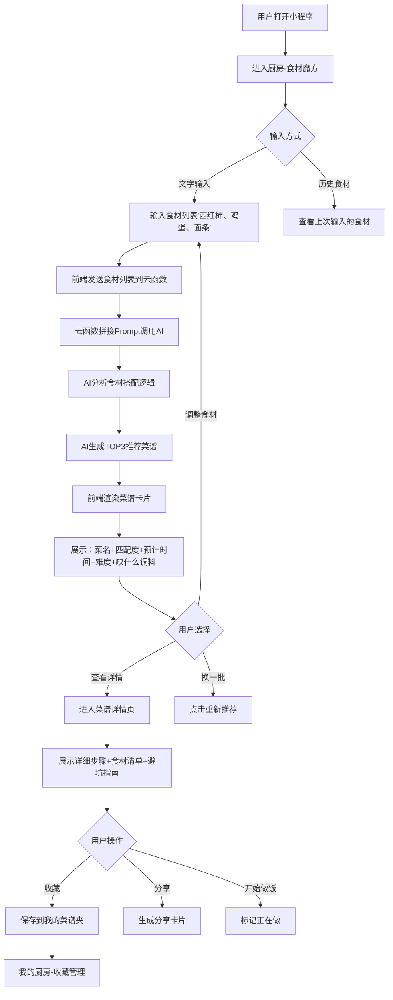
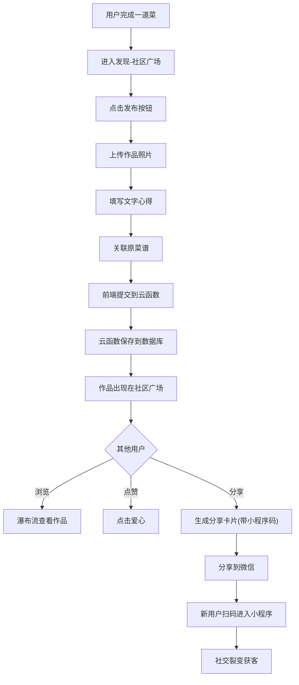
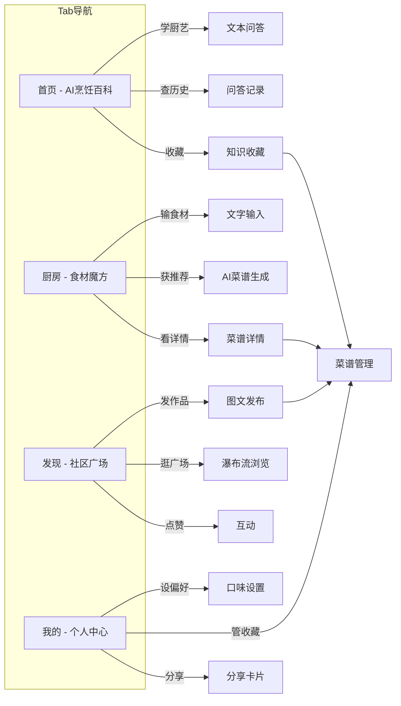

# 《ChefPal》需求分析文档

## 一、需求背景

### 1.1 产品定位

**一句话定位：** "你的口袋AI厨师——从食材到餐桌，全程智能陪伴。"

**核心差异化：** 不做"菜谱大全"（下厨房已做），不做"社区平台"（豆果已做），做**动态生成式烹饪伴侣**——基于你的食材、你的身体、你的目标，实时生成专属方案。

**产品愿景：** 让每一个不会做饭的人都能轻松下厨，让每一个会做饭的人都能吃得更好、更健康。

### 1.2 市场背景

| 维度                 | 关键数据                                               |
| -------------------- | ------------------------------------------------------ |
| **全球烹饪应用市场** | 2024年估值12亿美元，预计2033年达35亿美元（CAGR 12.5%） |
| **AI餐饮市场**       | 2025年达150亿美元，同比增长38.9%                       |
| **国内市场**         | 中国团餐市场规模突破2万亿元，"数智营养"成为2026年热点  |
| **关键事件**         | Yummly（2600万用户）于2024年12月关闭，市场出现空白     |
| **验证信号**         | 豆果AI营养师上线65天吸引259万用户关注，证明需求真实    |

### 1.3 用户痛点

1. **不知道做什么**：打开冰箱不知道能做什么菜，传统菜谱平台靠关键词搜索，无法匹配现有食材
2. **怕翻车**：菜谱步骤太复杂，新手看不懂、做不好，缺乏避坑指导
3. **健康难规划**：减脂/增肌/孕期等目标下，不知道如何搭配营养、生成周计划
4. **剩菜浪费**：经常买菜买多，冰箱边角料不知道怎么消耗
5. **学厨艺门槛高**：看到视频/文档想学，但信息分散，没有结构化总结

### 1.4 核心用户画像

| 用户类型       | 典型特征                         | 核心痛点                             | 使用场景                                |
| -------------- | -------------------------------- | ------------------------------------ | --------------------------------------- |
| **厨房小白**   | 20-35岁，独居/合租，做饭经验<1年 | 不知道做什么、怎么做、怕翻车         | 下班打开冰箱→拍照→AI推荐→照着做         |
| **健康管理族** | 25-45岁，有健身/减脂/孕期需求    | 想吃健康但不知道怎么搭配、没时间规划 | 设定目标→AI生成周计划→生成购物清单→执行 |
| **食材消消乐** | 任何年龄段，经常买菜买多         | 冰箱剩菜不知道怎么消耗、浪费严重     | 拍照现有食材→AI推荐组合→清空冰箱        |

### 1.5 竞品格局

| 竞品           | 类型               | 核心短板                                   | 我们的机会                             |
| -------------- | ------------------ | ------------------------------------------ | -------------------------------------- |
| **下厨房**     | UGC社区+电商       | 无个性化、搜索靠关键词、内容质量参差       | 用AI生成替代固定库，解决"不知道做什么" |
| **豆果美食**   | UGC+AI尝试         | AI营养师偏向"检索已有菜谱"而非"生成新菜谱" | 做**生成式**而非**检索式**             |
| **ChefGPT**    | AI食谱生成（海外） | 付费墙高（$19.99/月）、无免费试用          | 做免费基础版+本土化                    |
| **小菜一碟**   | AI拍照菜谱（国内） | 功能单一，无膳食规划、无学习模块           | 做功能矩阵：学+做+规划                 |
| **抖音"探饭"** | AI美食推荐         | 偏向"推荐餐厅/外卖"而非"教做饭"            | 差异化：**教做饭**而非**点外卖**       |

**市场空白结论：**
- ❌ 国内没有一款同时覆盖"学厨艺+食材识别+膳食规划"的AI烹饪助手
- ❌ 现有产品多为"检索式"，而非"生成式"
- ❌ 没有将"用户动态目标"与"冰箱现有食材"实时联动的产品

---

## 二、MVP 最小可行功能点

> **原则：** 前期只做最核心的功能，不要过于复杂，最好能一口气完成。验证核心假设："用户是否愿意用AI辅助烹饪决策"。

### 2.1 MVP功能清单

#### 🏠 模块一：AI烹饪百科（首页Tab）

| 功能         | 描述                                                         | 优先级 |
| ------------ | ------------------------------------------------------------ | ------ |
| **文本问答** | 用户输入任意厨艺问题，AI联网搜索并结构化回答（步骤+食材+避坑） | P0     |
| **问答历史** | 保存最近20条问答记录，支持快速查看                           | P0     |
| **收藏问答** | 将优质问答收藏到个人知识库                                   | P1     |

> **MVP暂不实现：** 语音输入、文档上传、视频链接解析、网页链接解析（技术复杂度高，使用频率待验证）

#### 🍳 模块二：食材魔方（厨房Tab）

| 功能             | 描述                                                    | 优先级 |
| ---------------- | ------------------------------------------------------- | ------ |
| **文字输入食材** | 手动输入食材列表（如"西红柿、鸡蛋、面条"），AI推荐菜谱  | P0     |
| **AI生成菜谱**   | 基于食材组合，AI实时生成3道推荐菜谱，含步骤、时间、难度 | P0     |
| **匹配度标注**   | 标注每道菜的"食材匹配度"和"缺什么调料"                  | P1     |
| **收藏菜谱**     | 将AI生成的菜谱收藏到个人菜谱夹                          | P1     |

> **MVP暂不实现：** 拍照识别、语音输入（图像识别准确率低，先验证文字输入的核心需求）

#### 👤 模块三：我的厨房（我的Tab）

| 功能             | 描述                                                   | 优先级 |
| ---------------- | ------------------------------------------------------ | ------ |
| **微信一键登录** | 微信授权登录，自动创建用户档案                         | P0     |
| **个人口味设置** | 设置忌口（过敏/宗教）、口味偏好（辣度/咸淡）、技能水平 | P1     |
| **我的收藏**     | 查看收藏的问答和菜谱，支持分类标签                     | P1     |
| **分享卡片**     | 将AI生成的菜谱生成精美卡片，分享到微信好友/朋友圈      | P1     |

> **MVP暂不实现：** 个人菜谱创作、作品记录、数据统计、身高体重等身体数据

#### 🌐 模块四：社区广场（发现Tab）

| 功能         | 描述                               | 优先级 |
| ------------ | ---------------------------------- | ------ |
| **作品发布** | 用户上传跟做作品照片+文字心得      | P1     |
| **作品广场** | 瀑布流浏览其他用户的作品，支持点赞 | P1     |
| **分享传播** | 作品支持生成分享卡片，带小程序码   | P1     |

> **MVP暂不实现：** 关注系统、评论互动、话题标签、搜索发现

---

## 三、后续扩展功能点（优先级排序）

### 🔴 P1 - 高优先级（MVP上线后立即迭代）

| 功能             | 说明                                        | 预期价值                                       |
| ---------------- | ------------------------------------------- | ---------------------------------------------- |
| **拍照识食材**   | 拍摄冰箱/食材照片，AI识别具体单品           | 解决"打开冰箱不知道有什么"的核心场景，体验升级 |
| **语音输入**     | 长按语音按钮描述食材或提问                  | 做饭时双手不便触屏，语音是刚需                 |
| **3天膳食规划**  | 基于用户画像生成3天食谱计划（简化版周计划） | 验证"健康管理族"需求，降低生成成本             |
| **个人菜谱创作** | 用户可创建/编辑自己的菜谱，支持图文步骤     | 从"消费者"转为"创作者"，提升留存               |
| **评论互动**     | 作品下支持评论交流                          | 社区活跃度基础功能                             |

### 🟡 P2 - 中优先级（验证核心假设后）

| 功能             | 说明                                           | 预期价值               |
| ---------------- | ---------------------------------------------- | ---------------------- |
| **7天膳食规划**  | 完整周计划 + 营养分析（热量/蛋白质/脂肪/碳水） | 满足健康管理族深度需求 |
| **购物清单生成** | 根据菜谱/周计划自动生成采购清单                | 全链路闭环，提升粘性   |
| **视频链接解析** | 粘贴抖音/B站视频链接，AI提取字幕生成步骤清单   | 学习型用户核心场景     |
| **网页链接解析** | 粘贴菜谱网页，AI提取正文结构化输出             | 降低信息获取成本       |
| **文档上传解析** | 上传PDF/Word烹饪文档，AI提取关键技法           | 专业用户深度需求       |
| **关注系统**     | 关注喜欢的创作者，查看关注动态                 | 社区关系链基础         |
| **话题标签**     | #今日晚餐 #减脂餐 等标签聚合                   | 内容分发效率提升       |

### 🟢 P3 - 低优先级（远期探索）

| 功能              | 说明                                                  | 预期价值                       |
| ----------------- | ----------------------------------------------------- | ------------------------------ |
| **AI口味记忆**    | 动态学习用户偏好（收藏/跳过/点赞行为），越用越懂你    | 从工具升级为伙伴，建立情感连接 |
| **语音烹饪助手**  | 做饭时全程语音交互："下一步""放多少盐"                | 解放双手，沉浸式体验           |
| **黑暗料理拯救**  | 拍照上传翻车现场，AI诊断问题并给出补救方案            | 超预期亮点，社交传播点         |
| **食材过期预警**  | 记录食材购买时间，AI提醒"西红柿已放5天，建议今天做掉" | 减少浪费，提升使用频次         |
| **多智能体协作**  | 营养师Agent+大厨Agent+采购Agent同时输出               | 技术炫点，差异化体验           |
| **时令食材日历**  | 根据季节和地域推荐当季食材和菜谱                      | 提升内容新鲜度                 |
| **烹饪挑战活动**  | 社区发起"一周只花50元""只用微波炉"等挑战              | 游戏化运营，提升活跃           |
| **家庭口味投票**  | 生成3个选项→分享到家庭群→投票决定今晚吃什么           | 家庭场景社交裂变               |
| **菜谱DNA进化树** | 每道菜谱记录修改轨迹，形成进化树                      | 社区内容自然生长，降低UGC成本  |
| **品牌合作**      | 与调味品/食材品牌合作推荐产品                         | 商业模式探索                   |

---

## 四、用户操作流程图（Mermaid）

### 4.1 核心流程一：AI问答学厨艺

### 4.2 核心流程二：根据食材推荐菜谱

### 4.3 核心流程三：发布作品到社区

### 4.4 整体小程序架构流程

---

## 五、需求功能核对清单

### 5.1 MVP阶段任务清单

#### 模块一：AI烹饪百科（首页）

- [ ] **UI-1.1** 首页Tab页面框架搭建（输入框+历史列表+收藏入口）
- [ ] **UI-1.2** 问答输入框组件（支持多行文本、发送按钮）
- [ ] **UI-1.3** AI回答展示组件（结构化渲染：秘诀/食材/步骤/避坑）
- [ ] **UI-1.4** 问答历史列表页（最近20条，支持删除）
- [ ] **UI-1.5** 收藏问答列表页
- [ ] **API-1.1** 云函数：接收用户问题，调用AI大模型API
- [ ] **API-1.2** 云函数：AI Prompt工程（联网搜索+结构化输出）
- [ ] **API-1.3** 云函数：保存问答历史到数据库
- [ ] **API-1.4** 云函数：收藏/取消收藏问答
- [ ] **DATA-1.1** 数据库设计：问答历史表（user_id, question, answer, created_at）
- [ ] **DATA-1.2** 数据库设计：问答收藏表

#### 模块二：食材魔方（厨房）

- [ ] **UI-2.1** 厨房Tab页面框架（食材输入区+推荐结果区）
- [ ] **UI-2.2** 食材输入组件（标签式输入，支持删除）
- [ ] **UI-2.3** 菜谱推荐卡片组件（菜名+匹配度+时间+难度）
- [ ] **UI-2.4** 菜谱详情页（步骤列表+食材清单+收藏按钮）
- [ ] **UI-2.5** "缺什么调料"提示组件
- [ ] **API-2.1** 云函数：接收食材列表，调用AI生成菜谱
- [ ] **API-2.2** 云函数：AI Prompt工程（食材组合推理+匹配度打分+替代方案）
- [ ] **API-2.3** 云函数：保存生成的菜谱到用户收藏
- [ ] **DATA-2.1** 数据库设计：AI生成菜谱表（recipe_id, ingredients, steps, difficulty, time）
- [ ] **DATA-2.2** 数据库设计：用户收藏菜谱关联表

#### 模块三：我的厨房（我的）

- [ ] **UI-3.1** 我的Tab页面框架（头像+昵称+功能入口）
- [ ] **UI-3.2** 微信登录按钮+授权流程
- [ ] **UI-3.3** 个人口味设置页（忌口/辣度/咸淡/技能水平）
- [ ] **UI-3.4** 我的收藏页（分类Tab：问答/菜谱）
- [ ] **UI-3.5** 分享卡片生成组件（带小程序码水印）
- [ ] **API-3.1** 云函数：微信登录授权，创建用户档案
- [ ] **API-3.2** 云函数：保存/更新用户口味偏好
- [ ] **API-3.3** 云函数：获取用户收藏列表
- [ ] **API-3.4** 云函数：生成分享卡片图片（canvas绘制）
- [ ] **DATA-3.1** 数据库设计：用户表（openid, nickname, avatar, preferences）
- [ ] **DATA-3.2** 数据库设计：用户收藏关联表

#### 模块四：社区广场（发现）

- [ ] **UI-4.1** 发现Tab页面框架（作品瀑布流+发布按钮）
- [ ] **UI-4.2** 作品发布页（图片上传+文字输入+关联菜谱）
- [ ] **UI-4.3** 作品卡片组件（头像+昵称+图片+文字+点赞数）
- [ ] **UI-4.4** 作品详情页（大图+点赞按钮+分享按钮）
- [ ] **API-4.1** 云函数：发布作品（保存图片+文字+关联关系）
- [ ] **API-4.2** 云函数：获取作品广场列表（分页加载）
- [ ] **API-4.3** 云函数：点赞/取消点赞
- [ ] **API-4.4** 云函数：生成作品分享卡片
- [ ] **DATA-4.1** 数据库设计：作品表（post_id, user_id, images, content, recipe_id, likes）
- [ ] **DATA-4.2** 数据库设计：点赞表

#### 通用基础

- [ ] **BASE-1** 微信小程序注册与认证（个人主体，"生活服务-餐饮"类目）
- [ ] **BASE-2** 微信云开发环境配置（数据库+存储+云函数）
- [ ] **BASE-3** Vant Weapp组件库引入与主题配置
- [ ] **BASE-4** 全局TabBar配置（首页/厨房/发现/我的）
- [ ] **BASE-5** 全局样式与颜色规范定义
- [ ] **BASE-6** 网络请求封装（含错误处理、加载状态）
- [ ] **BASE-7** 用户登录状态全局管理
- [ ] **BASE-8** 数据埋点基础（页面访问、按钮点击）

### 5.2 扩展阶段任务清单（P1优先级）

- [ ] **EXT-1.1** 拍照识食材：调用图像识别API，识别冰箱照片中的食材
- [ ] **EXT-1.2** 拍照结果修正：允许用户手动调整识别结果
- [ ] **EXT-2.1** 语音输入：微信小程序录音+语音转文字集成
- [ ] **EXT-3.1** 3天膳食规划：基于用户画像生成3天食谱
- [ ] **EXT-3.2** 膳食规划展示：早中晚三餐+营养估算
- [ ] **EXT-4.1** 个人菜谱创作：用户自定义菜谱编辑页
- [ ] **EXT-4.2** 个人菜谱发布：将原创菜谱分享到社区
- [ ] **EXT-5.1** 评论系统：作品下发表评论
- [ ] **EXT-5.2** 评论列表：作品详情页展示评论

### 5.3 扩展阶段任务清单（P2优先级）

- [ ] **EXT-6.1** 7天膳食规划：完整周计划生成
- [ ] **EXT-6.2** 营养分析：每餐热量/蛋白质/脂肪/碳水计算
- [ ] **EXT-7.1** 购物清单：根据菜谱/周计划生成采购清单
- [ ] **EXT-8.1** 视频链接解析：粘贴抖音/B站链接，AI提取字幕生成步骤
- [ ] **EXT-9.1** 网页链接解析：粘贴菜谱网页，AI结构化提取
- [ ] **EXT-10.1** 文档上传解析：PDF/Word上传，AI提取关键技法
- [ ] **EXT-11.1** 关注系统：关注/取消关注创作者
- [ ] **EXT-11.2** 关注动态：查看关注用户的最新作品
- [ ] **EXT-12.1** 话题标签：发布时添加标签，广场支持标签筛选

### 5.4 扩展阶段任务清单（P3优先级）

- [ ] **EXT-13.1** AI口味记忆：记录用户行为（收藏/跳过/点赞），定期分析偏好
- [ ] **EXT-13.2** 口味记忆注入：推荐时自动注入偏好到Prompt
- [ ] **EXT-14.1** 语音烹饪助手：做饭时语音交互"下一步""放多少"
- [ ] **EXT-15.1** 黑暗料理拯救：上传翻车照片，AI诊断+补救方案
- [ ] **EXT-16.1** 食材过期预警：记录购买时间，到期提醒
- [ ] **EXT-17.1** 多智能体协作：营养师+大厨+采购Agent同时输出
- [ ] **EXT-18.1** 时令食材日历：季节推荐+地域推荐
- [ ] **EXT-19.1** 烹饪挑战活动：社区运营活动后台
- [ ] **EXT-20.1** 家庭口味投票：生成选项+家庭群投票
- [ ] **EXT-21.1** 菜谱DNA进化树：记录菜谱修改轨迹
- [ ] **EXT-22.1** 品牌合作：品牌推荐位+合作后台

---

## 六、关键假设与验证指标

| 假设                   | 验证方法             | MVP成功指标              |
| ---------------------- | -------------------- | ------------------------ |
| 用户愿意用AI生成菜谱   | 观察厨房Tab使用频率  | 周活跃用户>50%使用AI推荐 |
| 用户愿意用AI问答学厨艺 | 观察首页问答使用频率 | 人均每周问答≥3次         |
| 用户愿意分享作品       | 观察社区发布量       | 日新增作品≥5条           |
| 微信小程序是合适载体   | 观察分享率和留存率   | 7日留存>15%，分享率>10%  |
| 用户有口味设置需求     | 观察口味设置完成率   | 设置率>30%               |

---

## 七、风险提醒

| 风险                 | 应对策略                                                     |
| -------------------- | ------------------------------------------------------------ |
| **AI生成菜谱不可靠** | MVP阶段加"免责声明"；用户反馈入口；后续引入RAG检索增强       |
| **API成本超支**      | 设置每日免费调用上限；超出后引导"明日再来"；优先使用低成本模型 |
| **微信小程序审核**   | 避免医疗/减肥绝对化表述；加"仅供参考，非医疗建议"免责声明    |
| **用户留存低**       | 社区功能提供社交粘性；分享卡片带来裂变；收藏功能提供回访理由 |
| **大厂跟进**         | 聚焦微信小程序+本土化体验；快速迭代建立口碑；社区壁垒        |

---

## 八、下一步行动

1. [ ] **注册微信小程序**：个人主体，"生活服务-餐饮"类目
2. [ ] **申请AI API**：建议先用豆包/通义千问（成本低、中文好）
3. [ ] **设计核心页面原型**：首页问答 + 厨房推荐 + 菜谱详情（3个核心页面）
4. [ ] **招募种子用户**：提前在朋友圈预热，收集早期反馈
5. [ ] **启动开发**：按MVP任务清单逐项完成
